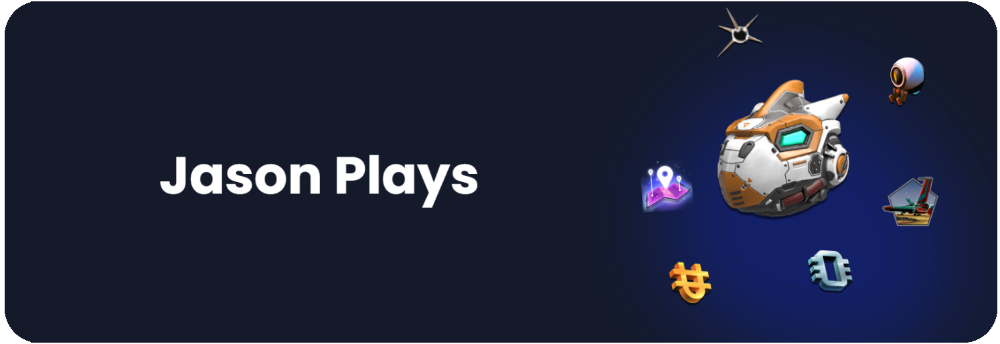
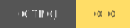

  
  

  ### Source code for the official Jason Plays website! 🎉 This project started with me ([Khaoz-Topsy](https://github.com/Khaoz-Topsy)) building a quick website for Jason Plays and later demoing it. 
  
  Jason liked it enough to purchase his domain and after a bit of tinkering...  BAM, Jason Plays has a website! 🥳
  
  
  
  
  
  [][twitter]
  [][discord]

 

## 🏃‍♂️ Running the project

 

  
### Requirements
- [NodeJS](https://nodejs.org/en/download/)

### Steps:
1. Clone this repository
2. In the directory where the `package.json` file is, run `npm i`
3. Build up all the data and generate the site `npm run build`
4. Use `npm run dev` to view the compiled site locally on [localhost:8080](http://127.0.0.1:8080)

 

<!-- Links used in the page -->
[twitter]: https://twitter.com/JasonPlaysNMS?ref=KurtGithub
[discord]: https://discord.gg/WUPmjM8H9V?ref=KurtGithub
